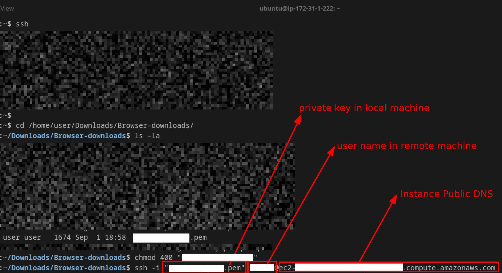

# Goal is to practice using linux commands

## Introduction to Basic Linux Commands

Linux commands are essential for interacting with the operating system and managing files and directories. This section provides a brief overview of some commonly used Linux commands.

- [Navigating the File System](linux-practice/Basic-linux-commands/Navigating-the-File-System.md)
- [System Monitoring](linux-practice/Basic-linux-commands/system-monitoring.md)
- [File System Structure and Monitoring](linux-practice/Basic-linux-commands/File-System-Structure.md)
- [Directory and File Operations](linux-practice/Basic-linux-commands/Directory-and-File-Operations.md)
- [Hardlink and soft link](linux-practice/Basic-linux-commands/Hardlink-and-soft-link.md)
- [Text Processing and File Comparison](linux-practice/Basic-linux-commands/Text-Processing-and-File-Comparison.md)

## Advanced Linux Commands

- **How SSH  into EC2 instance using key pair**: (Assuming EC2 instance is created on AWS and private key is downloaded on local machine)

- [System Resource Monitoring and Management](linux-practice/Advanced-linux-commands/System-Resource-Monitoring-and-Management.md)  

- [System-level commands](linux-practice/Advanced-linux-commands/System-level-commands.md)  

- [Users and Groups Management](linux-practice/Advanced-linux-commands/Users-and-Groups-Management.md)

- [File Management In Linux](linux-practice/Advanced-linux-commands/File-Management.md)

- [File Transfer Commands](linux-practice/Advanced-linux-commands/File-Transfer-Commands.md)

- [Linux Networking Commands]()

- [Linux Commands like AWK, GREP, FIND, SED for searching]()

- [Linux Volume Management In Linux]()
