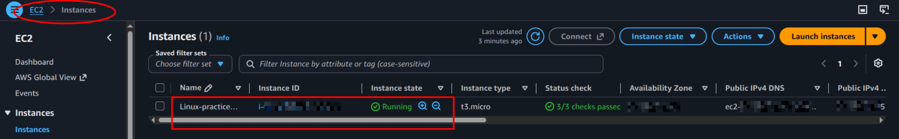
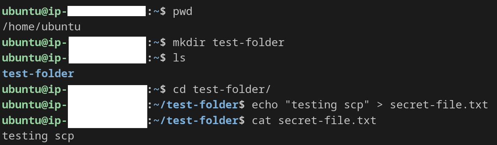

# Secure File Transfer Protocols: SCP & Rsync Reference

This reference covers transferring files between a local machine and a remote server (AWS EC2) using scp and rsync, along with troubleshooting common errors encountered during practice (**mistakes are mentioned in linux-mistakes.md file**).

1. Prerequisites & Connection
- Remote Instance Setup: AWS EC2 Ubuntu instance (t3.micro) running in aws-region.
- SSH Key Pair: ec2-private-key.pem stored on the local host at /home/guy/Downloads/ec2-private-key.pem.
- SSH Connection Command: `ssh -i "/home/guy/Downloads/ec2-private-key.pem" ubuntu@ec2-IPv4.aws-region.compute.amazonaws.com`





---

2. Secure Copy Protocol (scp)
- scp copies files and directories securely over SSH. All scp commands for local-to-remote or remote-to-local transfers must be executed from your local terminal session, not inside the remote SSH session.

- Direct Command Reference

## Transfer File from Remote Server to Local Host:
```Bash
scp -i "/home/guy/Downloads/ec2-private-key.pem" ubuntu@ec2-IPv4.aws-region.compute.amazonaws.com:/home/ubuntu/test-folder/secret-file.txt /home/guy/Downloads/devops-notes/test/scp-file-receiver-folder

/home/guy/Downloads/ec2-private-key.pem = EC2 downloaded private key on local host
ubuntu@ec2-IPv4.aws-region.compute.amazonaws.com = ec2-primary-username@ec2-public-DNS
:/home/ubuntu/test-folder/secret-file.txt = :/file/location/at/remote/source
/home/guy/Downloads/devops-notes/test/scp-file-receiver-folder = /destination/location/at/local/host
```

## Transfer Directory Recursively from Local Host to Remote Server (-r):
```Bash
scp -i "/home/guy/Downloads/ec2-private-key.pem" -r /home/guy/Downloads/devops-notes/test ubuntu@ec2-IPv4.aws-region.compute.amazonaws.com:/home/ubuntu
```

---

3. Remote Synchronization (rsync)

## rsync minimizes data transfer by synchronizing only modified or new files between locations over SSH.

- Key Flags Breakdown
```
-a (archive): Preserves file permissions, timestamps, symlinks, and directory structures recursively.

-v (verbose): Outputs detailed file transfer information to stdout.

-z (compress): Compresses data during transfer to optimize bandwidth.

-e: Specifies the remote shell command and options (e.g., identity file location for SSH).
```

## Direct Command Reference

- Push Local Directory to Remote Server:
```Bash
rsync -e "ssh -i /home/guy/Downloads/ec2-private-key.pem" -avz /home/guy/Downloads/devops-notes/test ubuntu@ec2-IPv4.aws-region.compute.amazonaws.com:/home/ubuntu/test
```

- Pull Remote Directory to Local Host:
```Bash
rsync -e "ssh -i /home/guy/Downloads/ec2-private-key.pem" -avz ubuntu@ec2-IPv4.aws-region.compute.amazonaws.com:/home/ubuntu/test /home/guy/Downloads/devops-notes/test
```

### Trailing Slash (/) Trait in Rsync:
- rsync ... /source/dir /destination creates a subfolder /destination/dir.
- rsync ... /source/dir/ /destination copies only the contents of dir into /destination.
